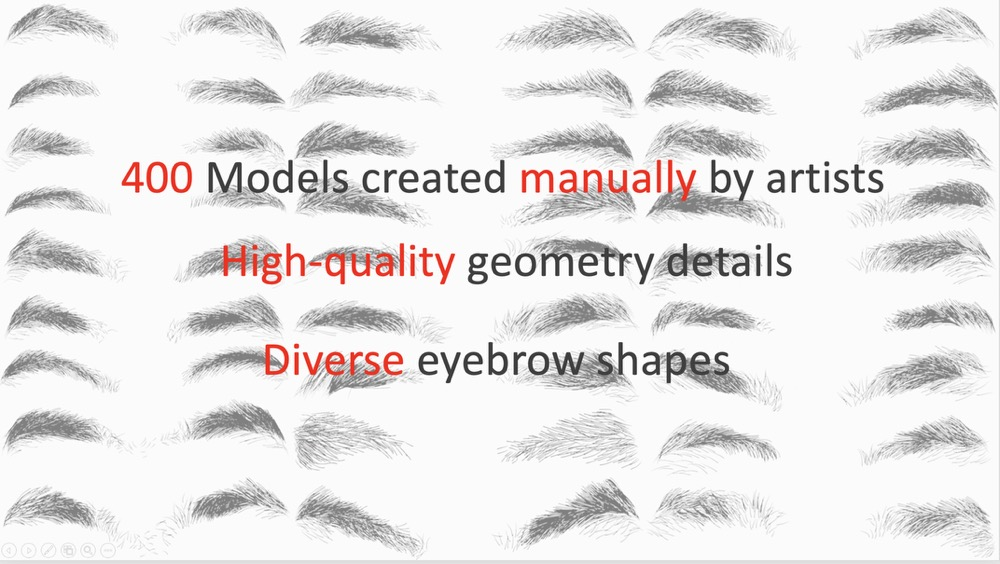

# EMS EBStore dataset
This repository provides the EBStore dataset of EMS.
> ***EMS***: EMS: 3D Eyebrow Modeling from Single-view Images
>
> [Chenghong Li](https://kevinlee09.github.io)\*, Leyang Jin\*, [Yujian Zheng](https://paulyzheng.github.io/about/),  [Yizhou Yu](https://i.cs.hku.hk/~yzyu/)<sup>#</sup>
 and [Xiaoguang Han](https://gaplab.cuhk.edu.cn/)<sup>#</sup>


### [Project Page](https://kevinlee09.github.io/research/EMS/) | [Paper (Arxiv)](https://arxiv.org/abs/2309.12787)

<div style="width: 100%; text-align: center; margin:auto;">
    <br>
</div>


EBStore is the first high-quality 3D synthetic eyebrow dataset containing 400 high-quality 3D models. These eyebrow models are manually created by artists using particle edit mode in Blender, guided by both the high-resolution texture map of the eyebrow region and the front-facing image of the individual.

## Dataset
<div style="width: 100%; text-align: center; margin:auto;">
    <br>
</div>

To download EBStore data, please visit [OneDrive](https://cuhko365.sharepoint.com/:u:/s/SSE_GAP-Lab/ESrM3H8kOr5IuVgKRi0OtfIBmpblvEz3yEHHfB0oddpi7A?e=F4ihLg). After unzipping the downloaded file, you will find the following directory structure:

  ```
  ├── EBStore_blender_data
  │   ├── 1
  │   │   ├── 1_uv.jpg
  │   │   ├── 1.blend
  │   │   ├── 1.obj
  |   |   ├── h.mtl
  |   |   ├── h.obj
  |   |   ├── m.mtl
  │   │   └── m.obj
  │   ├── 2
  │   │   ├── 2_uv.jpg
  │   │   ├── 2.blend
  │   │   ├── 2.obj
  │   │   ├── h.mtl
  │   │   ├── h.obj
  │   │   ├── m.mtl
  │   │   └── m.obj
  ├── ...
  ```


## Environment
We test our code on [blender-3.4.0](https://www.blender.org/download/releases/3-4/) and [blender-3.6.14](https://www.blender.org/download/releases/3-6/).

## Convert hair blend files to npy format 
```
python hair2npy.py --input ./EBStore_blender_data --output ./strand_npy_rekey
```

## Convert npy to obj format
```
python npy2obj.py --output ./strand_npy_rekey --output ./strand_obj_rekey
```


## License
The data and the code are released under the Attribution-NonCommercial 4.0 International License.

Copyright (c) 2024


## Citation
<!-- --- -->

If you find the data and code of this work helpful to your research, please consider citing:

```bibtex
@article{li2023ems,
  title={EMS: 3D Eyebrow Modeling from Single-view Images},
  author={Li, Chenghong and Jin, Leyang and Zheng, Yujian and Yu, Yizhou and Han, Xiaoguang},
  journal={ACM Transactions on Graphics (TOG)},
  volume={42},
  number={6},
  pages={1--19},
  year={2023},
  publisher={ACM New York, NY, USA}
}
```

